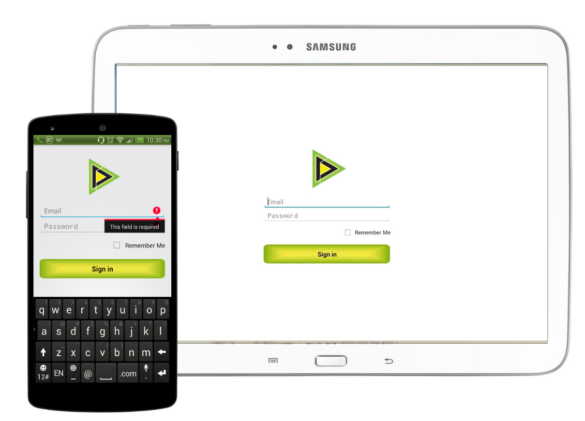
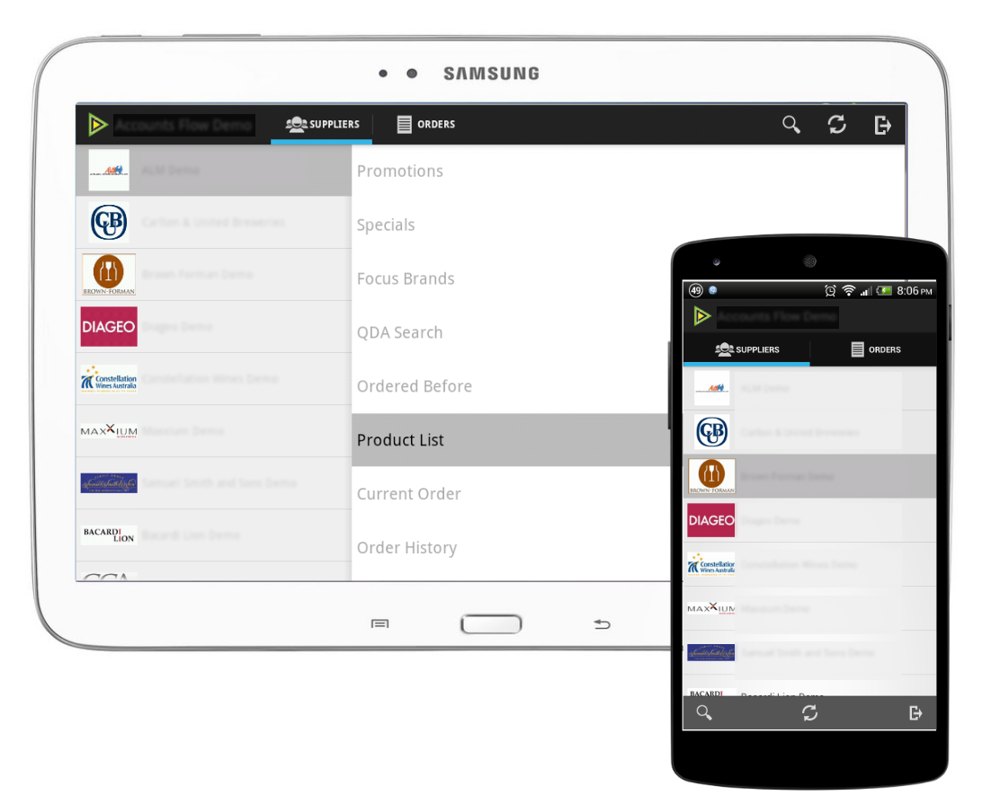

# Android app to view and order beverages from suppliers

This project is an Android app to view and order beverages from suppliers. This repository contains code samples that display beverage supplier information and product details from a backend API into list and detail views. The code sample focuses on the UI structure of the app.

Some screenshots of how the app looks like

